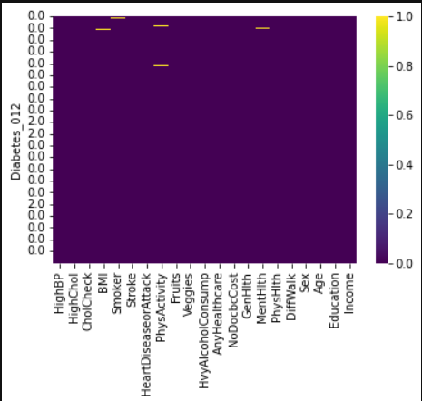

# Laboratorio 1 - Clasificación

### Elaborado por Camilo Salinas, Nicolas Orjuela y Felipe Bedoya.

## Descripción y análisis de perfilamiento de los datos y de las tareas sugeridas de transformación.

Para obtener una visión del estado actual de la calidad y la distribución de los datos se importo el CSV a PowerBI para poder ver estas métricas. Desde el Power Query Editor, y desde el contexto del Codebook pudimos ver que los datos son de tipo numérico. Aún así, algunas columnas tienen ciertos datos que no pueden ser procesados, como datos vacíos o datos no numéricos.

Directamente en el Notebook pudimos ver un poco mejor estas métricas para poder decidir que era lo mas pertinente.

Aquí podemos ver que los datos NaN (es decir, los vacios o caracteres que no pueden ser procesados) no representan un porcentaje importante en los datos y se sugiere como primera tarea de transformación eliminarlos.
