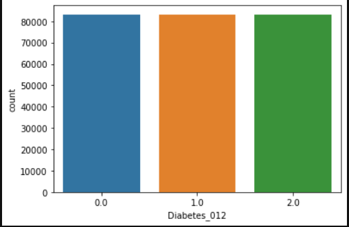

# Laboratorio 1 - Clasificación

### Elaborado por Camilo Salinas, Nicolás Orjuela y Felipe Bedoya.

## Descripción y análisis de perfilamiento de los datos y de las tareas sugeridas de transformación.

Para obtener una visión del estado actual de la calidad y la distribución de los datos se importo el CSV a PowerBI para poder ver estas métricas. Desde el Power Query Editor, y desde el contexto del Codebook pudimos ver que los datos son de tipo numérico. Aún así, algunas columnas tienen ciertos datos que no pueden ser procesados, como datos vacíos o datos no numéricos.

Dentro del PowerQuery pudimos ver que debido a que al final de las lineas del CSV existe una repetición del carácter de terminación, existen 5 columnas vaciás. Se recomienda eliminarlas ya que podrían afectar el modelo negativamente y causar errores.

Directamente en el Notebook pudimos ver un poco mejor estas métricas para poder decidir que era lo mas pertinente.

Aquí podemos ver que los datos NaN (es decir, los vacíos o caracteres que no pueden ser procesados) no representan un porcentaje importante en los datos y se sugiere como primera tarea de transformación eliminarlos.

Podemos en el Notebook ver una gráfica de barras que nos indica el balanceo de los datos, contabilizando cuantos datos hay para cada una de las etiquetas del dataset. Tener un desbalanceo de datos puede afectar negativamente el modelo enseñándolo a clasificar una etiqueta muy bien pero muy mal en otras.

Como parte de la utilidad entregada a SaludAlpes, se incluye un tablero de PowerBI en donde esta la caracterización de los datos y un resumen del comportamiento, datos vacíos y relación entre estos.

El archivo del tablero es **tablero LAB1.pbix** en el repositorio.

Empezar a ver relaciones de los datos es importante para poder escoger correctamente los features del modelo. Se recomienda un análisis mas avanzado de correlación y una limpieza de columnas.

Finalmente se recomienda hacer una estandarización o normalización de los datos (dependiendo de a cual beneficie el modelo) y convertir los datos al tipo más pequeño para reducir la complejidad computacional de los modelos.

## Descripción del preprocesamiento realizado, según el algoritmo utilizado

En esta sección se especificará por algoritmo el proceso de preprocesamiento realizado en el dataset.

### Random Forest Classifier.

#### Este modelo fue realizado por Felipe Bedoya.

El modelo se encuentra en el repositorio como **./Modelos/Modelo_RandomForest_f.bedoya.ipynb**.

Para este modelo después de realizar el análisis de perfilamiento de los datos, se decidió tratar con los datos NaN desde un principio. Después de ver en PowerBI como se comportaban las excepciones, se decidió importar el CSV como un DataFrame llamado df_diabetes de tipo unicode y que considera los valores NaN a: "-", "Xx" y "?". Teniendo datos NaN es mas fácil eliminarlos que teniendo objects (strings).

    missing_values = ["-", 'Xx', '?']
    df_diabetes = pd.read_csv('../Resources/202210_Laboratorio1_data_Datos_Clasificacion_2022.csv', sep=';', encoding='utf-8', index_col=0, dtype='unicode', na_values= missing_values)

Para la limpieza de las columnas se eliminan las vaciás que se mencionaron anteriormente:

    df_diabetes = df_diabetes.iloc[:,:-5]

Se eliminan los datos NaN ya que no representan un porcentaje considerable de los datos:

    df_diabetes = df_diabetes.dropna()

Y adicionalmente se convierten los datos a su tipo mas apropiado (En un principio Pandas los convierte a Float64, pero se hizo al cambio a Float16 para optimizar el entrenamiento).

    df_diabetes = df_diabetes.convert_dtypes()
    ...
    # Más adelante despues de haber preprocesado los datos y haberlos partido en sets de entrenamiento y prueba:
    ...
    X = X.astype('float16')
    Y = Y.astype('float16')

Ahora utilizamos el StandardScaler de Scikit Learn para estandarizar los datos. Vale la pena mencionar que en un principio se tenia la intención de utilizar un GaussianProcessClassifier, pero al final decidimos utilizar un RandomForestClassifier ya que es mas eficiente y no requiere mucho tiempo de entrenamiento. El GPC si se veía beneficiado por estandarizar los datos pero en clasificadores de tipo árbol no afecta mucho.

    from sklearn.preprocessing import StandardScaler
    std_scaler = StandardScaler()
    df_std = pd.DataFrame(std_scaler.fit_transform(df_diabetes), columns=df_diabetes.columns)

Como vimos anteriormente, los datos están gravemente desbalanceados. Debemos balancearlos y se decidió utilizar la técnica SMOTE. Considerando el beneficio de crear datos sintéticos no duplicados.

    from imblearn.over_sampling import SMOTE
    oversample = SMOTE()
    df_std, Y = oversample.fit_sample(df_std, Y)

Ahora utilizamos el método de Pearson para encontrar la correlación entre las columnas y seleccionar las que sean más correlacionadas.

Analizamos los resultados y de la lista de relevant_features solo sacamos los que tienen un coeficiente de correlación mayor a 0.1. (Sacando un sample de 5 del dataset:)

Finalmente hacemos la partición de los datos en el set de entrenamiento y el set de prueba. Se escogió una relación de 0.20 debido a los buenos resultados que dio manualmente:

    X_train, X_test, Y_train, Y_test = train_test_split(X, Y, test_size = 0.20, random_state = 18)
    
### K-NN.

#### Este modelo fue realizado por Nicolás Orjuela.

El modelo se encuentra en el repositorio como **./Modelos/Modelo_KNN_n.orjuela.ipynb**.

El preprocesamiento de los datos a utilizar en este modelo fue similar al realizado por Felipe Bedoya. Se trató con los datos NaN desde el principio, se eliminaron las ultimas 5 columnas vacías de la tabla y se eliminaron las pocas tuplas con valores NaN.

En este caso se normalizaron los datos en vez de estandarizarlos (como se realizo en el RandomForest), esto fue debido a que el algoritmo KNN toma los datos numéricos como distancias, por lo que es mejor que todos los datos estuvieran en la misma escala (de 0 a 1) y así evitar que el algoritmo malinterprete estos tipos de datos.

    df_diabetes_pru = df_diabetes.copy()
    normalized_df=(df_diabetes_pru-df_diabetes_pru.min())/(df_diabetes_pru.max()-df_diabetes_pru.min())
    normalized_df
    df_diabetes = normalized_df
 

Posteriormente, al igual que en RandomForest, se decidió utlizar la técnica SMOTE y balancear los datos para obtener un modelo más eficiente a la hora de predecir personas prediabéticas o diabéticas. Además, se utilizó el método de Pearson para encontrar la correlación entre las columnas y seleccionar las que sean más correlacionadas. Con esta información se eliminaron aquellas columnas que tuvieran un coeficiente de correlación menor a 0.1.

Para la partición de los datos en el set de entrenamiento y el set de prueba se escogió una relación de 0.15:

    X_train, X_test, Y_train, Y_test = train_test_split(X, Y, test_size = 0.15, random_state = 98572398)

## Implementación de K-NN, descripción de las decisiones más importantes asociadas a la implementación del algoritmo y los hiperparametros configurados

#### Este modelo fue realizado por Nicolás Orjuela.

Para escoger los mejores hiperparametros para el modelo se realizó una búsqueda de valores de grid search con un a validación cruzada de 10 K-Folds, ya que este valor retorna una estimación con un sesgo bajo y una varianza modesta.
El número de vecinos está en un rango de 16 a 22, ya que anteriormente en la realización de modelos K-NN se decidió que en este rango está el mejor k.

Despues de entrenar el modelo, se pone a prueba con los datos de prueba y se obtienen las métricas de calidad.

## Implementación de un tercer algoritmo de libre elección, descripción de las decisiones más importantes asociadas a la implementación del algoritmo y los hiperparametros configurados

#### Este modelo fue realizado por Felipe Bedoya.

Se escogió el RandomForestClassifier por descarte. Se empezó con GaussianProcessClassifier que se ajusta mucho mejor a los datos pero requería mucho poder de computación. Algo similar ocurrió con RBF SVM por lo que se escogió el RandomForestClassifier.

Para escoger los hiperparametros se consideraron los que mas afectan el desempeño del modelo sin tener una alta demanda de recursos.

Para escoger el valor mas optimo de estos hiperparametros se utilizó una búsqueda de valores de grid search con una validación cruzada de 10 KFolds.

- No se consideró n_estimators como un hiperparametro dentro del grid search porque es un valor que afecta el rendimiento computacional del modelo.

- Debido a que es un modelo basado en arboles, el criterio de pureza si se considero, habiendo las opciones de Gini y Entropy.

- Max_features también se incluyo en el grid search ya que afecta directamente la elección del mejor split e los features, lo que puede afectar directamente el desempeño del modelo.

- Se utiliza como hiperparametro fijo n_jobs para que el modelo haga uso de procesos paralelos. En caso de requerirlo puede disminuirlo.

 

    param_grid = {
    'criterion': ['gini','entropy'],
    'bootstrap': [True, False],
    'max_features': ['auto','sqrt','log2'] ,
    }
    particiones = KFold(n_splits=10, shuffle=True, random_state = 123)
    model = RandomForestClassifier(n_jobs=8, n_estimators=100)
    mejor_modelo = GridSearchCV(model, param_grid, cv=particiones)

Finalmente se entrena el modelo y se obtiene el mejor estimador:

    mejor_modelo.fit(X_train, Y_train)
    mejor_modelo.best_params_
    arbol_final = mejor_modelo.best_estimator_

Después de entrenarlo, se utiliza el dataset de prueba para encontrar las métricas de calidad del modelo y la matriz de confusion.

